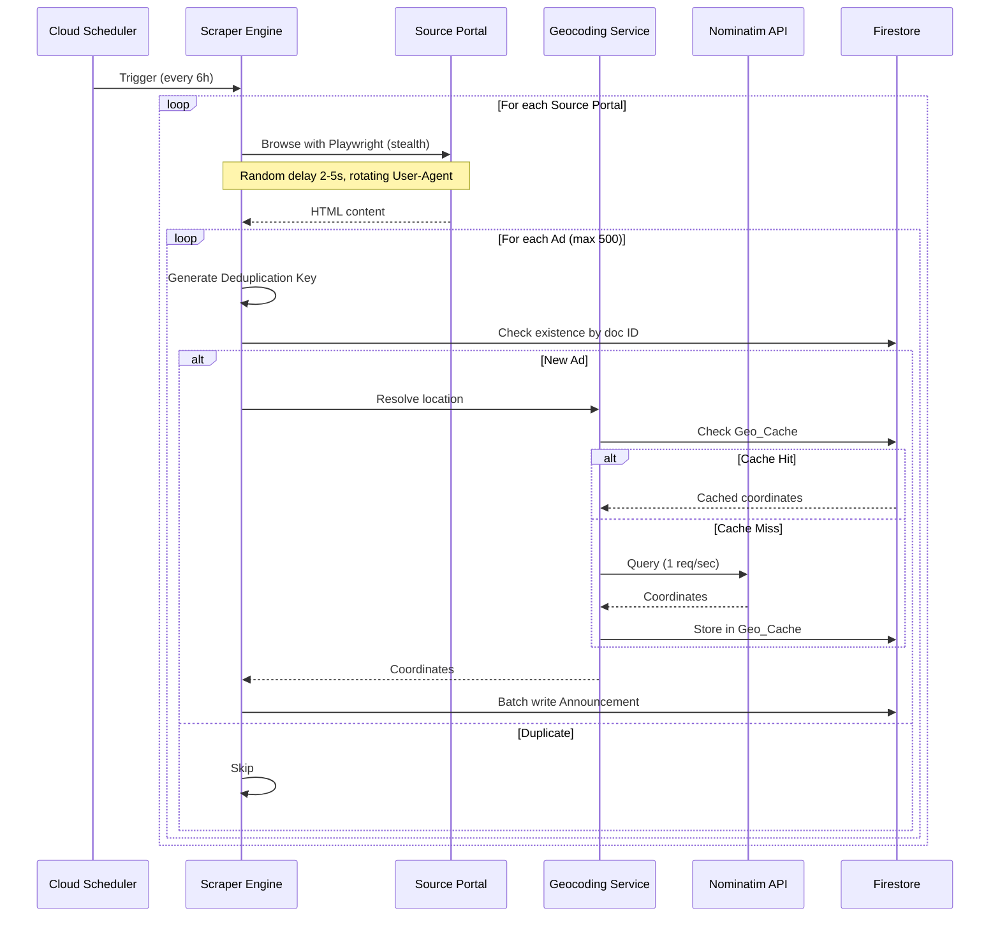
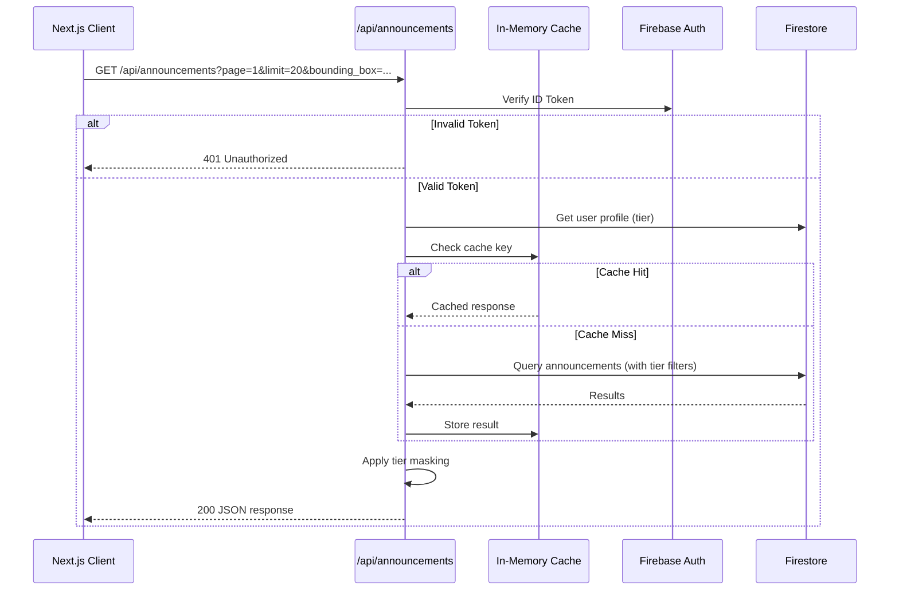

# Design Document: Construction Ads Aggregator

## Overview

The Construction Ads Aggregator is a production SaaS MVP that scrapes construction/renovation advertisements from Polish portals (OLX, Oferteo, Fixly) for the Szczecin area (50km radius), deduplicates and geocodes them, and presents them through an interactive map and list interface with freemium access control.

The system follows a modular monolith architecture split across two deployment targets:
- **Frontend + API Layer**: Next.js App Router on Vercel (Server Actions, API Routes)
- **Backend Engine**: Node.js modules deployed as Firebase Cloud Functions v2

### Key Design Decisions

| Decision | Choice | Rationale |
|----------|--------|-----------|
| Scraping runtime | Firebase Cloud Functions v2 | Supports up to 60min timeout, scales to zero, cron triggers built-in |
| Database | Firestore | Serverless, Security Rules for tier enforcement, batch writes, composite indexes |
| Geocoding | Nominatim + Firestore cache | Free (no API key), aggressive caching avoids 1 req/s rate limit |
| Map rendering | React-Leaflet + OpenStreetMap | Free tiles, no usage limits, mature React bindings |
| Auth | Firebase Authentication | Tight Firestore integration, handles tokens/sessions |
| Email notifications | Nodemailer + SMTP | Zero cost with personal SMTP, no vendor lock-in |
| PBT library | fast-check | Best TypeScript PBT library, excellent Vitest integration |

## Architecture

### System Architecture Diagram

```mermaid
graph TB
    subgraph "Vercel"
        FE[Next.js App Router]
        API[/api/announcements]
        CACHE[In-Memory Cache TTL:60s]
    end

    subgraph "Firebase Cloud Functions v2"
        SCHED[Cloud Scheduler every 6h]
        SCRAPER[Scraper Engine - Playwright + Stealth]
        GEOCODER[Geocoding Service]
        NOTIFIER[Notification Processor]
    end

    subgraph "Firebase Suite"
        AUTH[Firebase Authentication]
        FS[(Firestore)]
        LOG[Cloud Logging]
    end

    subgraph "External Free Services"
        OLX[OLX.pl]
        OFERTEO[Oferteo.pl]
        FIXLY[Fixly.pl]
        NOM[Nominatim API]
        OSM[OpenStreetMap Tiles]
    end

    FE --> API
    API --> CACHE
    CACHE --> FS
    API --> AUTH
    FE --> OSM
    SCHED --> SCRAPER
    SCRAPER --> OLX
    SCRAPER --> OFERTEO
    SCRAPER --> FIXLY
    SCRAPER --> FS
    SCRAPER --> GEOCODER
    GEOCODER --> FS
    GEOCODER --> NOM
    SCRAPER --> NOTIFIER
    NOTIFIER --> FS
    SCRAPER --> LOG
    AUTH --> FS
```

### Scraping Pipeline Flow



### API Request Flow



## Components and Interfaces

### 1. Scraper Engine (`functions/src/scraper/`)

```typescript
interface ScraperConfig {
  cronSchedule: string;           // Default: "0 */6 * * *"
  maxAdsPerPortal: number;        // Default: 500
  minDelayMs: number;             // Default: 2000
  maxDelayMs: number;             // Default: 5000
  maxRetries: number;             // Default: 3
  retryBaseDelayMs: number;       // Default: 2000
  retryMultiplier: number;        // Default: 2
  userAgents: string[];           // Min 5 entries
}

interface ScrapedAd {
  nativeId: string | null;
  title: string;
  description: string;
  sourceUrl: string;
  sourcePortal: SourcePortal;
  category: string;
  locationText: string;
  price: number | null;
  contactInfo: string | null;
  publishedAt: Date | null;
}

type SourcePortal = 'olx' | 'oferteo' | 'fixly';

interface ScrapingResult {
  portal: SourcePortal;
  adsScraped: number;
  adsDeduplicated: number;
  adsStored: number;
  errors: ScrapingError[];
}

interface ScrapingError {
  portal: SourcePortal;
  timestamp: Date;
  reason: string;
  retryAttempt: number;
}

// Cloud Function entry point
export const scheduledScraper = onSchedule(
  { schedule: "0 */6 * * *", timeoutSeconds: 540, memory: "1GiB" },
  async (event: ScheduledEvent): Promise<void>
);

// Portal-specific scraper interface
interface PortalScraper {
  portal: SourcePortal;
  scrape(browser: Browser, config: ScraperConfig): Promise<ScrapedAd[]>;
}
```

### 2. Deduplication Service (`functions/src/deduplication/`)

```typescript
// Pure function: generates deduplication key from ad data
function generateDeduplicationKey(ad: ScrapedAd): string;
// If nativeId is non-empty: `${portal}-${nativeId}`
// Otherwise: SHA-256 hex of `${title}|${publishedAt}|${description}`

// Check if announcement already exists in Firestore
async function checkExists(firestore: Firestore, key: string): Promise<boolean>;

// Batch check existence for multiple keys
async function batchCheckExists(
  firestore: Firestore, keys: string[]
): Promise<Map<string, boolean>>;
```

### 3. Geocoding Service (`functions/src/geocoding/`)

```typescript
interface GeocodingResult {
  latitude: number | null;
  longitude: number | null;
  fromCache: boolean;
}

interface GeoCacheEntry {
  locationText: string;
  latitude: number | null;
  longitude: number | null;
  resolvedAt: Date;
  isNegative: boolean;
}

// Pure function: normalizes location text for cache key
function normalizeLocationText(text: string): string;
// Steps: trim -> collapse whitespace -> lowercase -> truncate 1500 bytes

// Resolve location to coordinates (cache-first)
async function resolveLocation(
  locationText: string, firestore: Firestore
): Promise<GeocodingResult>;

// Pure function: build Nominatim query string
function buildNominatimQuery(trimmedText: string): string;
// Returns: `${trimmedText}, Szczecin, Poland`

// Rate-limited Nominatim client
class NominatimRateLimiter {
  private lastRequestTime: number;
  constructor(minIntervalMs: number); // 1000ms
  async waitForSlot(): Promise<void>;
  async query(text: string): Promise<{ lat: number; lng: number } | null>;
}
```

### 4. Notification Processor (`functions/src/notifications/`)

```typescript
interface NotificationPreferences {
  centerLat: number;
  centerLng: number;
  radiusKm: number;           // 1-50
  enabled: boolean;
}

// Pure function: haversine distance between two points in km
function haversineDistanceKm(
  lat1: number, lng1: number, lat2: number, lng2: number
): number;

// Pure function: check if announcement is within user's radius
function isWithinRadius(
  announcement: { latitude: number; longitude: number },
  prefs: NotificationPreferences
): boolean;

// Pure function: consolidate announcements for email (max 10)
function consolidateForEmail(announcements: Announcement[]): Announcement[];

// Send consolidated notification email
async function sendNotificationEmail(
  recipientEmail: string,
  announcements: Announcement[],
  transporter: Transporter
): Promise<void>;
```

### 5. API Layer (`app/api/announcements/`)

```typescript
interface AnnouncementQueryParams {
  page: number;            // min 1
  limit: number;           // min 1, max 100, default 20
  source_portal?: SourcePortal;
  bounding_box?: BoundingBox;
}

interface BoundingBox {
  south_lat: number;
  west_lng: number;
  north_lat: number;
  east_lng: number;
}

interface PaginatedResponse<T> {
  data: T[];
  metadata: {
    total_count: number;
    current_page: number;
    page_size: number;
    total_pages: number;
  };
}

// Pure function: validate query parameters
function validateQueryParams(params: Record<string, string>): 
  { valid: true; parsed: AnnouncementQueryParams } | 
  { valid: false; error: string };

// Pure function: apply tier-based masking to announcements
function applyTierMasking(
  announcements: Announcement[], 
  tier: 'free' | 'premium',
  currentTime: Date
): MaskedAnnouncement[];

// Pure function: calculate pagination metadata
function calculatePagination(
  totalCount: number, page: number, pageSize: number
): PaginatedResponse<never>['metadata'];
```

### 6. Password Validation (`lib/validation/`)

```typescript
// Pure function: validate password meets requirements
function validatePassword(password: string): 
  { valid: true } | { valid: false; reasons: string[] };
// Rules: 8+ chars, at least one uppercase, one lowercase, one digit
```

### 7. Batch Writer (`functions/src/batch/`)

```typescript
// Pure function: split documents into batch groups
function splitIntoBatches<T>(documents: T[], maxBatchSize: number): T[][];
// Each batch has at most maxBatchSize items (default 500)
```

## Data Models

### Firestore Collections

#### `announcements` Collection

| Field | Type | Description |
|-------|------|-------------|
| `deduplication_key` | `string` (Document ID) | Unique key: `${portal}-${nativeId}` or SHA-256 hash |
| `title` | `string` | Ad title |
| `description` | `string` | Full ad description |
| `source_url` | `string` | Original URL on source portal |
| `source_portal` | `string` | One of: `olx`, `oferteo`, `fixly` |
| `category` | `string` | Ad category (e.g., "construction", "renovation") |
| `location_text` | `string` | Raw location text from ad |
| `latitude` | `number \| null` | Geocoded latitude, null if unresolved |
| `longitude` | `number \| null` | Geocoded longitude, null if unresolved |
| `price` | `number \| null` | Price in PLN, null if not listed |
| `contact_info` | `string \| null` | Contact details (phone/email) |
| `scraped_at` | `Timestamp` | When the ad was scraped |
| `published_at` | `Timestamp \| null` | When the ad was originally published |

#### `users` Collection

| Field | Type | Description |
|-------|------|-------------|
| `uid` | `string` (Document ID) | Firebase Authentication UID |
| `email` | `string` | User's email address |
| `display_name` | `string` | Display name (max 100 characters) |
| `tier` | `string` | Subscription tier: `free` or `premium` |
| `created_at` | `Timestamp` | Account creation timestamp |
| `updated_at` | `Timestamp` | Last profile update timestamp |
| `notification_prefs` | `NotificationPreferences \| null` | Premium notification settings |

**`notification_prefs` sub-object:**

| Field | Type | Description |
|-------|------|-------------|
| `center_lat` | `number` | Center latitude for notification radius |
| `center_lng` | `number` | Center longitude for notification radius |
| `radius_km` | `number` | Notification radius (1-50 km) |
| `enabled` | `boolean` | Whether notifications are active |

#### `geo_cache` Collection

| Field | Type | Description |
|-------|------|-------------|
| `location_text` | `string` (Document ID) | Normalized: lowercase, trimmed, whitespace-collapsed, max 1500 bytes |
| `latitude` | `number \| null` | Resolved latitude, null for negative cache |
| `longitude` | `number \| null` | Resolved longitude, null for negative cache |
| `resolved_at` | `Timestamp` | When geocoding was performed |

**TTL:** Entries older than 30 days are considered stale and re-fetched on next access.

### Composite Indexes

```
announcements:
  - (source_portal ASC, scraped_at DESC)
  - (scraped_at DESC, source_portal ASC)
  - (latitude ASC, longitude ASC, scraped_at DESC)
```

### TypeScript Data Models

```typescript
interface Announcement {
  deduplication_key: string;
  title: string;
  description: string;
  source_url: string;
  source_portal: 'olx' | 'oferteo' | 'fixly';
  category: string;
  location_text: string;
  latitude: number | null;
  longitude: number | null;
  price: number | null;
  contact_info: string | null;
  scraped_at: Date;
  published_at: Date | null;
}

interface MaskedAnnouncement {
  deduplication_key: string;
  title: string;
  description: string;          // Truncated to 100 chars + "..." for free tier
  source_portal: 'olx' | 'oferteo' | 'fixly';
  category: string;
  location_text: string;
  latitude: number | null;
  longitude: number | null;
  price: number | null;
  scraped_at: Date;
  published_at: Date | null;
  // source_url and contact_info omitted for free tier
  source_url?: string;
  contact_info?: string | null;
}

interface UserProfile {
  uid: string;
  email: string;
  display_name: string;
  tier: 'free' | 'premium';
  created_at: Date;
  updated_at: Date;
  notification_prefs: NotificationPreferences | null;
}

interface GeoCacheEntry {
  location_text: string;
  latitude: number | null;
  longitude: number | null;
  resolved_at: Date;
}
```

## Correctness Properties

*A property is a characteristic or behavior that should hold true across all valid executions of a system — essentially, a formal statement about what the system should do. Properties serve as the bridge between human-readable specifications and machine-verifiable correctness guarantees.*

### Property 1: Deduplication key generation determinism

*For any* scraped ad, if the native ID is a non-empty string, the deduplication key SHALL equal `${sourcePortal}-${nativeId}`. If the native ID is empty or null, the key SHALL equal the SHA-256 hex digest of `${title}|${publishedAt}|${description}`. In both cases, calling the function twice with the same input SHALL produce the same output.

**Validates: Requirements 2.1, 2.2**

### Property 2: Location text normalization is idempotent and case-insensitive

*For any* non-empty string, `normalizeLocationText(normalizeLocationText(s))` SHALL equal `normalizeLocationText(s)`. Additionally, for any two strings that differ only in letter casing, `normalizeLocationText(a)` SHALL equal `normalizeLocationText(b)`. The output SHALL always be ≤ 1500 bytes, trimmed, with consecutive whitespace collapsed to a single space.

**Validates: Requirements 3.2, 11.4**

### Property 3: Nominatim query construction appends geographic context

*For any* non-empty trimmed location text, `buildNominatimQuery(text)` SHALL return a string equal to `${text}, Szczecin, Poland`.

**Validates: Requirements 3.4**

### Property 4: Password validation correctness

*For any* string, `validatePassword(s)` SHALL return valid=true if and only if the string has length ≥ 8 AND contains at least one uppercase letter AND at least one lowercase letter AND at least one digit. For all other strings, it SHALL return valid=false.

**Validates: Requirements 4.4**

### Property 5: Tier-based time filtering

*For any* list of announcements and any reference timestamp, applying free-tier filtering SHALL return only announcements where `scraped_at` is more than 48 hours before the reference timestamp. Applying premium-tier filtering SHALL return all announcements regardless of `scraped_at` value. The output set for free tier SHALL always be a subset of the output set for premium tier.

**Validates: Requirements 5.1, 5.3, 8.6, 8.7**

### Property 6: Free-tier description masking

*For any* announcement, applying free-tier masking SHALL: if description length > 100 characters, truncate to first 100 characters followed by "..."; if description length ≤ 100 characters, return the description unchanged. The result SHALL never contain `source_url` or `contact_info` fields.

**Validates: Requirements 5.2**

### Property 7: Haversine distance and radius check

*For any* two geographic points (lat1, lng1) and (lat2, lng2) and any radius R (1 ≤ R ≤ 50 km), `isWithinRadius` SHALL return true if and only if `haversineDistanceKm(lat1, lng1, lat2, lng2) ≤ R`. The haversine function SHALL be commutative: `haversineDistanceKm(a, b) == haversineDistanceKm(b, a)`, and SHALL return 0 when both points are identical.

**Validates: Requirements 6.1**

### Property 8: Notification consolidation respects maximum

*For any* list of announcements, `consolidateForEmail` SHALL return a list of length `min(input.length, 10)`. The returned items SHALL be the first 10 items from the input list, preserving order.

**Validates: Requirements 6.6**

### Property 9: Map marker coordinate filtering

*For any* list of announcements, the set of announcements rendered as map markers SHALL include only those where both `latitude` is non-null AND `longitude` is non-null. No announcement with null latitude or null longitude SHALL appear as a marker.

**Validates: Requirements 7.2**

### Property 10: Query parameter validation

*For any* set of query parameters, `validateQueryParams` SHALL return invalid if: page < 1, limit < 1, limit > 100, bounding_box contains non-numeric values or doesn't have exactly 4 comma-separated decimals, or source_portal is not one of "olx", "oferteo", "fixly". For all other inputs conforming to the constraints, it SHALL return valid with correctly parsed values.

**Validates: Requirements 8.4**

### Property 11: Pagination metadata calculation

*For any* `total_count ≥ 0`, `page ≥ 1`, and `page_size` between 1 and 100, `calculatePagination` SHALL return: `total_pages = Math.ceil(total_count / page_size)`, `current_page = page`, and `page_size` equal to the input page_size. When total_count is 0, total_pages SHALL be 0.

**Validates: Requirements 8.8**

### Property 12: Announcement list sort order

*For any* list of announcements returned by the list view, for every consecutive pair of announcements (a[i], a[i+1]), `a[i].scraped_at >= a[i+1].scraped_at` SHALL hold (descending order).

**Validates: Requirements 10.1**

### Property 13: Batch write splitting

*For any* list of N documents and max batch size of 500, `splitIntoBatches` SHALL produce `Math.ceil(N / 500)` batches where each batch has at most 500 items, and the total number of items across all batches equals N. The order of documents SHALL be preserved.

**Validates: Requirements 12.2**

### Property 14: Exponential backoff calculation

*For any* retry attempt number n (0, 1, 2) with base delay 2000ms and multiplier 2, the calculated delay SHALL equal `2000 * 2^n` milliseconds (2000, 4000, 8000 for attempts 0, 1, 2 respectively).

**Validates: Requirements 1.6**

## Error Handling

### Scraping Errors

| Error Scenario | Handling Strategy | Recovery |
|---------------|-------------------|----------|
| Portal page load timeout | Retry with exponential backoff (2s, 4s, 8s) | Continue to next portal after 3 failures |
| Bot detection / CAPTCHA | Log warning, skip portal for this run | Next scheduled run retries |
| Invalid HTML structure | Log parsing error, skip individual ad | Continue processing remaining ads |
| Network connectivity loss | Retry with backoff | Abort run after all portals fail |

### Geocoding Errors

| Error Scenario | Handling Strategy | Recovery |
|---------------|-------------------|----------|
| Nominatim rate limit (429) | Queue and retry after 1 second delay | Respect rate limiter |
| Nominatim returns no result | Store negative cache entry (null coords) | Skip for 30 days (TTL) |
| Nominatim service unavailable | Log warning, store announcement without coords | Re-geocode on next cache miss after TTL |
| Invalid location text (empty/whitespace) | Skip geocoding entirely | Store announcement without coordinates |

### API Layer Errors

| Error Scenario | HTTP Code | Response |
|---------------|-----------|----------|
| Missing/invalid Firebase ID token | 401 | `{ "error": "Authentication required" }` |
| User tier not found in profile | 403 | `{ "error": "Authorization failed" }` |
| Invalid query parameters | 400 | `{ "error": "Invalid parameter: {name}" }` |
| Firestore read failure | 503 | `{ "error": "Service temporarily unavailable" }` |
| Internal server error | 500 | `{ "error": "Internal server error" }` |

### Authentication Errors

| Error Scenario | Handling Strategy | Client Behavior |
|---------------|-------------------|-----------------|
| Registration with existing email | Return generic error (don't reveal existence) | Display error, preserve form data |
| Invalid credentials | Return generic "authentication failed" message | Display error, allow retry |
| Firebase Auth service unavailable | Return 503 | Display offline message, preserve form data |
| Expired token on API request | Return 401 | Client refreshes token and retries |

### Notification Errors

| Error Scenario | Handling Strategy | Recovery |
|---------------|-------------------|----------|
| SMTP connection failure | Log error, skip notification | No retry for that announcement |
| Invalid recipient email | Log error, mark notification failed | No retry |
| Notification processing timeout | Log timeout, process remaining users | Next batch picks up |

### Global Error Handling Principles

1. **Fail gracefully**: Never crash the entire scraping run for a single ad/portal failure
2. **Log comprehensively**: All errors logged to Firebase Cloud Logging with context (timestamp, portal, ad ID if available)
3. **Preserve data**: On partial failure, save what was successfully processed
4. **User-friendly messages**: Client-facing errors never expose internal details or stack traces
5. **Idempotent retries**: Deduplication ensures retried operations don't create duplicates

## Testing Strategy

### Testing Framework

- **Unit & Property Testing**: Vitest + fast-check
- **Component Testing**: React Testing Library
- **E2E Testing**: Playwright
- **API Integration**: Supertest with Firebase Emulator Suite

### Property-Based Tests (fast-check)

Each correctness property is implemented as a property-based test with minimum 100 iterations.

| Property | Module Under Test | Generator Strategy |
|----------|------------------|--------------------|
| 1: Dedup key generation | `deduplication/` | Arbitrary strings for title/desc/date, arbitrary portal names, optional native IDs |
| 2: Location normalization | `geocoding/` | Arbitrary unicode strings with random whitespace/casing |
| 3: Nominatim query | `geocoding/` | Arbitrary non-empty trimmed strings |
| 4: Password validation | `validation/` | Arbitrary strings of varying length and character composition |
| 5: Tier time filtering | `api/` | Arbitrary announcement lists with random scraped_at timestamps, arbitrary reference time |
| 6: Description masking | `api/` | Arbitrary strings of varying length (0 to 10000 chars) |
| 7: Haversine + radius | `notifications/` | Arbitrary lat/lng pairs (-90..90, -180..180), arbitrary radius 1-50 |
| 8: Consolidation | `notifications/` | Arbitrary lists of 0-100 announcement objects |
| 9: Coordinate filtering | `map/` | Arbitrary announcement lists with nullable lat/lng |
| 10: Query param validation | `api/` | Arbitrary objects with random types/values for each param |
| 11: Pagination metadata | `api/` | Arbitrary positive integers for total, page, page_size |
| 12: Sort order | `list/` | Arbitrary announcement lists |
| 13: Batch splitting | `batch/` | Arbitrary arrays of 0-2000 items |
| 14: Backoff calculation | `scraper/` | Integers 0-2 for retry attempt |

**Tag format**: Each test tagged with `Feature: construction-ads-aggregator, Property {N}: {title}`

### Unit Tests (Vitest)

- **Scraper module**: Test portal-specific HTML parsing with fixtures, User-Agent rotation selection, delay range validation
- **Deduplication**: Test edge cases — empty strings, special characters in titles, null native IDs
- **Geocoding**: Test cache hit/miss flows with mocked Firestore, negative cache behavior
- **API endpoint**: Test auth middleware, response formatting, error responses
- **UI components**: Test rendering states (loading, error, empty, populated)

### Integration Tests

- **Scraper → Firestore**: Full scrape-to-store flow using Firebase Emulator
- **API → Firestore**: Request lifecycle with real Firestore Emulator queries
- **Geocoding → Nominatim**: Rate limiting verification with mock HTTP server
- **Auth flow**: Registration and login with Firebase Auth Emulator

### E2E Tests (Playwright)

- Map loads and displays markers
- List view pagination and infinite scroll
- Free tier sees masked content, premium sees full content
- Navigation between tabs works on mobile viewport
- Login/registration flow

### Test Configuration

```typescript
// vitest.config.ts
export default defineConfig({
  test: {
    globals: true,
    environment: 'node',
    include: ['**/*.test.ts', '**/*.spec.ts'],
    coverage: {
      provider: 'v8',
      reporter: ['text', 'lcov'],
      thresholds: { lines: 80, branches: 75, functions: 80 }
    }
  }
});
```

### CI Pipeline

1. **Lint**: ESLint + Prettier check
2. **Type Check**: `tsc --noEmit`
3. **Unit + Property Tests**: `vitest --run` (includes fast-check property tests, 100+ iterations each)
4. **Integration Tests**: Firebase Emulator Suite + Vitest
5. **E2E Tests**: Playwright against preview deployment
6. **Coverage Gate**: Fail if below thresholds
