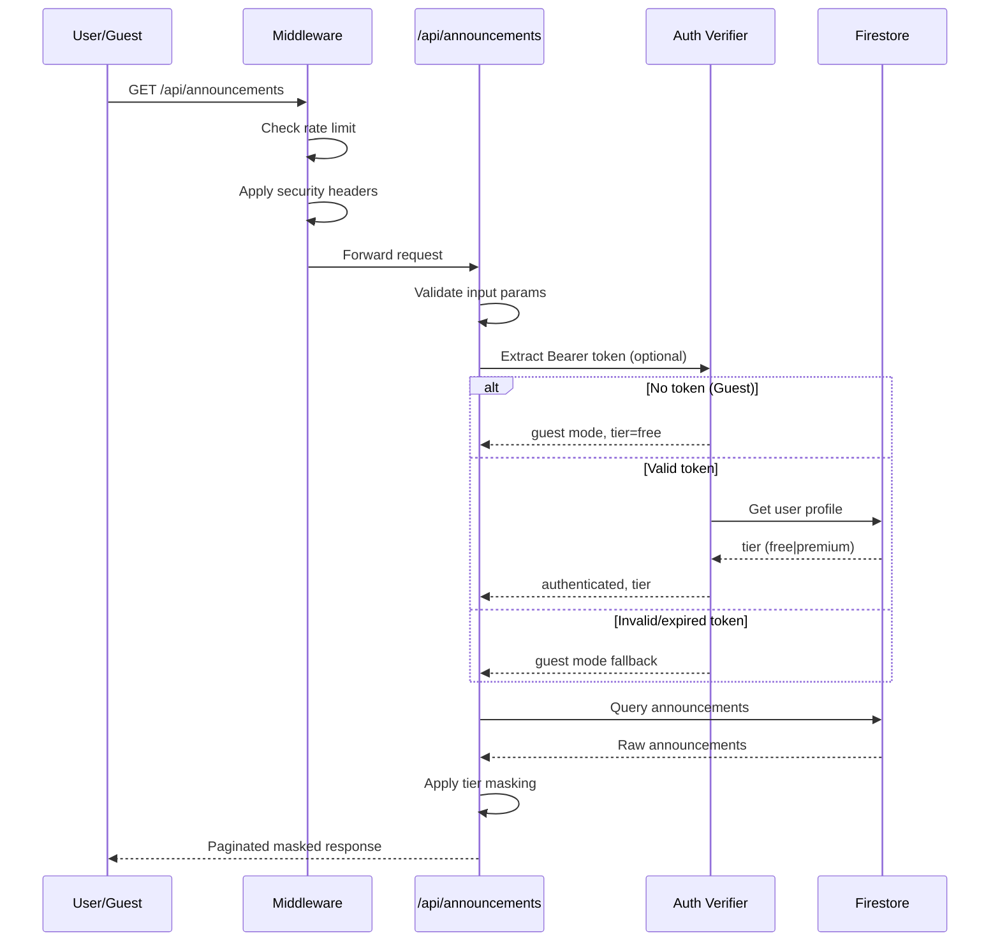

# Design Document: UX & Security Enhancements

## Overview

This design covers a comprehensive enhancement to the Construction Ads Aggregator MVP spanning six areas: guest browsing, authentication improvements (email verification + Google OAuth), OWASP security hardening, README documentation, mobile-first UI/UX overhaul, and Firestore security rules audit. The system is a Next.js 14 App Router application with Firebase Auth/Firestore, React-Leaflet mapping, and inline styles/CSS-in-JS.

### Key Design Decisions

1. **Guest mode via optional auth pattern**: Rather than a separate "anonymous" Firebase user, guests are served by allowing unauthenticated requests through the API layer with free-tier masking applied. This avoids creating ephemeral Firebase users.
2. **Middleware-based security**: Rate limiting, security headers, CSRF protection, and input validation are implemented as Next.js middleware and route-level wrappers rather than external proxies.
3. **CSS custom properties for theming**: Dark mode and design system tokens are implemented using CSS custom properties on `:root` / `[data-theme="dark"]` selectors, enabling instant theme switching without re-renders.
4. **Framer Motion for animations**: Leveraged for spring physics, gesture support (swipe navigation), and prefers-reduced-motion respect.
5. **fast-check for property testing**: Already in devDependencies, used for validating input sanitization, masking logic, and rate limiter behavior.

## Architecture

```mermaid
graph TD
    subgraph Client ["Browser (Next.js Client)"]
        A[App Shell / ResponsiveLayout]
        B[Auth Context Provider]
        C[Theme Provider]
        D[Token Manager]
        E[Toast System]
    end

    subgraph Pages ["Pages & Components"]
        F[HomePage - Guest/Auth]
        G[LoginPage + Google OAuth]
        H[Map View]
        I[Announcement List + Cards]
        J[Bottom Nav / Side Nav]
    end

    subgraph Middleware ["Next.js Middleware Layer"]
        K[Security Headers Middleware]
        L[Rate Limiter Middleware]
        M[CSRF Validator]
    end

    subgraph API ["API Routes"]
        N[/api/announcements GET]
        O[Input Validator]
        P[Auth Verifier - optional]
    end

    subgraph Backend ["Firebase Backend"]
        Q[Firebase Auth]
        R[Firestore - announcements]
        S[Firestore - users]
        T[Cloud Functions]
    end

    A --> B
    A --> C
    B --> D
    A --> E
    F --> N
    G --> Q
    N --> K
    N --> L
    N --> M
    N --> O
    N --> P
    P --> Q
    N --> R
    N --> S
```

### Request Flow (Guest vs Authenticated)



## Components and Interfaces

### 1. Auth Context Provider (`lib/auth/AuthContext.tsx`)

```typescript
interface AuthState {
  user: FirebaseUser | null;
  profile: UserProfile | null;
  isGuest: boolean;
  isEmailVerified: boolean;
  loading: boolean;
}

interface AuthContextValue extends AuthState {
  signInWithEmail: (email: string, password: string) => Promise<AuthResult<LoginResult>>;
  signInWithGoogle: () => Promise<AuthResult<LoginResult>>;
  register: (email: string, password: string, displayName: string) => Promise<AuthResult<RegistrationResult>>;
  signOut: () => Promise<void>;
  resendVerificationEmail: () => Promise<void>;
  refreshToken: () => Promise<string | null>;
}
```

### 2. Token Manager (`lib/auth/tokenManager.ts`)

```typescript
interface TokenManager {
  /** Start monitoring token expiry, auto-refresh when < 5min remaining */
  startAutoRefresh(): void;
  /** Stop monitoring */
  stopAutoRefresh(): void;
  /** Get current valid token, refreshing if needed */
  getValidToken(): Promise<string | null>;
  /** Clear all auth state from client */
  clearAuthState(): void;
  /** Retry a failed request after token refresh */
  retryWithFreshToken(originalRequest: () => Promise<Response>): Promise<Response>;
}
```

### 3. Rate Limiter (`lib/middleware/rateLimiter.ts`)

```typescript
interface RateLimitConfig {
  windowMs: number;          // Sliding window duration (60000ms)
  maxRequests: number;       // Max requests per window (100 general, 10 auth)
}

interface RateLimitEntry {
  timestamps: number[];      // Request timestamps within current window
}

interface RateLimitResult {
  allowed: boolean;
  retryAfterSeconds?: number;
  remaining: number;
}

function checkRateLimit(clientIp: string, config: RateLimitConfig): RateLimitResult;
```

### 4. Input Validator (`lib/validation/input.ts`)

```typescript
interface ValidationRule {
  type: 'string' | 'number' | 'boolean' | 'email';
  required?: boolean;
  maxLength?: number;
  min?: number;
  max?: number;
  pattern?: RegExp;
}

interface ValidationSchema {
  [fieldName: string]: ValidationRule;
}

interface ValidationResult {
  valid: boolean;
  errors: Array<{ field: string; reason: string }>;
  sanitized: Record<string, unknown>;
}

function validateAndSanitize(input: Record<string, unknown>, schema: ValidationSchema): ValidationResult;
function sanitizeString(input: string): string;
function stripHtmlTags(input: string): string;
```

### 5. CSRF Protection (`lib/middleware/csrf.ts`)

```typescript
interface CsrfConfig {
  cookieName: string;        // "__csrf"
  headerName: string;        // "x-csrf-token"
  tokenLength: number;       // 32 bytes
}

function generateCsrfToken(): string;
function validateCsrfToken(cookieToken: string, headerToken: string): boolean;
```

### 6. Theme Provider (`components/theme/ThemeProvider.tsx`)

```typescript
type ThemeMode = 'light' | 'dark' | 'system';

interface ThemeContextValue {
  mode: ThemeMode;
  resolvedTheme: 'light' | 'dark';
  setMode: (mode: ThemeMode) => void;
}
```

### 7. Toast Notification System (`components/feedback/ToastProvider.tsx`)

```typescript
type ToastType = 'success' | 'error' | 'info';

interface Toast {
  id: string;
  type: ToastType;
  message: string;
  duration: number;         // 3000ms success, 5000ms error
  dismissible: boolean;
}

interface ToastContextValue {
  show: (type: ToastType, message: string) => void;
  dismiss: (id: string) => void;
}
```

### 8. Security Headers Middleware (`middleware.ts`)

Applied via Next.js middleware to all routes:

```typescript
const securityHeaders = {
  'Content-Security-Policy': [
    "default-src 'self'",
    "script-src 'self'",
    "style-src 'self' 'unsafe-inline'",
    "img-src 'self' data: *.tile.openstreetmap.org",
    "connect-src 'self' https://*.googleapis.com https://*.firebaseio.com https://identitytoolkit.googleapis.com https://securetoken.googleapis.com",
    "frame-ancestors 'none'",
  ].join('; '),
  'X-Content-Type-Options': 'nosniff',
  'X-Frame-Options': 'DENY',
  'Referrer-Policy': 'strict-origin-when-cross-origin',
};
```

### 9. Guest Mode API Adapter

The existing `/api/announcements` route is modified to make auth optional:

```typescript
// Modified auth flow in route.ts
async function resolveUserContext(request: Request): Promise<{
  tier: 'free' | 'premium';
  isGuest: boolean;
  uid: string | null;
}> {
  const authHeader = request.headers.get('authorization');
  
  if (!authHeader || !authHeader.startsWith('Bearer ')) {
    return { tier: 'free', isGuest: true, uid: null };
  }

  const token = authHeader.slice(7);
  const result = await verifyIdToken(token);
  
  if (!result.success) {
    return { tier: 'free', isGuest: true, uid: null };
  }

  const userDoc = await adminFirestore.collection('users').doc(result.data.uid).get();
  const tier = userDoc.exists && userDoc.data()?.tier === 'premium' ? 'premium' : 'free';
  
  return { tier, isGuest: false, uid: result.data.uid };
}
```

## Data Models

### Updated User Profile (Firestore `users` collection)

```typescript
interface UserProfile {
  uid: string;
  email: string;
  display_name: string;
  tier: 'free' | 'premium';
  auth_provider: 'email' | 'google';        // NEW: track auth method
  email_verified: boolean;                    // NEW: verification status
  created_at: Timestamp;
  updated_at: Timestamp;
  notification_prefs: NotificationPreferences | null;
}
```

### Rate Limit Store (In-memory Map)

```typescript
// In-memory sliding window storage
const rateLimitStore = new Map<string, number[]>();
// Key: clientIP or `auth:${clientIP}` for auth endpoints
// Value: array of request timestamps within window
```

### Theme Preference (localStorage)

```typescript
interface ThemePreference {
  mode: 'light' | 'dark' | 'system';
}
// Stored at key: 'theme-preference'
```

### CSRF Token (Cookie + Header)

```
Cookie: __csrf=<random-32-byte-hex>; Secure; HttpOnly; SameSite=Strict
Header: x-csrf-token: <same-value>
```


## Correctness Properties

*A property is a characteristic or behavior that should hold true across all valid executions of a system—essentially, a formal statement about what the system should do. Properties serve as the bridge between human-readable specifications and machine-verifiable correctness guarantees.*

### Property 1: Guest tier masking invariants

*For any* list of announcements with varying `scraped_at` timestamps and description lengths, when `applyTierMasking` is called with tier `"free"` and a reference time, the result SHALL:
- contain only announcements where `scraped_at` is more than 48 hours before the reference time,
- have descriptions truncated to exactly 100 characters + "..." when the original exceeds 100 characters,
- omit `source_url` and `contact_info` fields from all returned items.

**Validates: Requirements 1.2**

### Property 2: Unauthenticated API requests receive guest-tier data

*For any* API request to `/api/announcements` that lacks a valid Bearer token (no Authorization header, malformed header, or invalid token), the API SHALL return HTTP 200 with response data that conforms to free-tier masking rules rather than HTTP 401.

**Validates: Requirements 1.5**

### Property 3: Form validation produces correct errors for all invalid states

*For any* form state where at least one field is invalid (empty required field, malformed email, weak password), the form validator SHALL return an error set where each error references the specific invalid field and a human-readable reason, and the total error count equals the number of invalid fields.

**Validates: Requirements 2.1, 2.4**

### Property 4: Password strength indicator correctness

*For any* password string, the strength indicator SHALL report exactly which criteria are satisfied: length >= 8, contains uppercase, contains lowercase, contains digit. The indicator reports valid=true if and only if all four criteria are met.

**Validates: Requirements 2.2, 2.3**

### Property 5: Form data preservation on submission error

*For any* form state (email, password, displayName) and any submission error (auth failure, network error, OAuth cancellation), after the error is displayed, all form field values SHALL remain identical to their pre-submission values.

**Validates: Requirements 2.8, 3.5**

### Property 6: Google first-login creates correct profile

*For any* Google user object with uid, email, and displayName, when authenticating for the first time (no existing profile), the system SHALL create a Firestore user profile with: uid matching Google uid, email matching Google email, display_name matching Google displayName, tier="free", auth_provider="google", notification_prefs=null, and valid created_at/updated_at timestamps.

**Validates: Requirements 3.3**

### Property 7: Google re-authentication is idempotent

*For any* existing user profile and subsequent Google OAuth authentication with the same uid, the profile document in Firestore SHALL remain unchanged (all field values identical before and after re-authentication).

**Validates: Requirements 3.4**

### Property 8: Input sanitization removes dangerous patterns

*For any* string containing HTML tags, `<script>` elements, event handler attributes, or SQL injection patterns (e.g., `'; DROP TABLE`, `OR 1=1`), the `sanitizeString` function SHALL return a string that contains none of these dangerous patterns while preserving the safe textual content.

**Validates: Requirements 4.3**

### Property 9: Input validation rejects oversized parameters

*For any* string parameter exceeding 200 characters (query params) or 1000 characters (body fields), the validator SHALL reject the input. *For any* request body exceeding 10KB total size, the API SHALL return HTTP 413.

**Validates: Requirements 4.4, 4.5**

### Property 10: Input validation error responses contain field and reason

*For any* invalid request parameter, the API response SHALL be HTTP 400 with a JSON body containing the invalid field name and a human-readable reason, and SHALL NOT contain stack traces, file paths, or internal identifiers.

**Validates: Requirements 4.1, 4.2**

### Property 11: Rate limiter enforces sliding window threshold

*For any* sequence of requests from the same IP, the rate limiter configured with window W and max M SHALL allow the first M requests within any W-millisecond window and reject request M+1 with HTTP 429 and a `Retry-After` header whose value equals the number of seconds until the oldest request in the window expires. This applies with M=100/W=60000 for general endpoints and M=10/W=60000 for auth endpoints.

**Validates: Requirements 5.1, 5.2, 5.3, 5.4**

### Property 12: CSRF token validation accepts matching pairs only

*For any* pair of tokens (cookieToken, headerToken), the CSRF validator SHALL return `true` if and only if both tokens are non-empty strings and `cookieToken === headerToken`.

**Validates: Requirements 6.3**

### Property 13: Error response sanitization

*For any* Error object thrown during API processing (with arbitrary message, stack trace, and internal details), the HTTP response SHALL always be `{ error: "Internal server error" }` with status 500, containing no stack traces, file paths, database queries, or implementation details.

**Validates: Requirements 6.5, 6.6**

### Property 14: Token refresh triggers at correct threshold

*For any* current time T and token expiry time E, the token manager SHALL trigger a refresh if and only if `E - T < 300000` (5 minutes in milliseconds) and the token is not already being refreshed.

**Validates: Requirements 7.1**

### Property 15: Sign-out clears all auth state

*For any* authentication state (stored tokens, cached user profile, localStorage entries), after `signOut()` completes, all auth-related keys in localStorage and in-memory state SHALL be empty/null.

**Validates: Requirements 7.4**

### Property 16: Announcement card contains all required fields

*For any* valid MaskedAnnouncement object, the rendered card component SHALL include: the title text, location_text, price (or "N/A" if null), source_portal identifier, and a relative time representation of scraped_at.

**Validates: Requirements 11.1**

### Property 17: Theme preference round-trip persistence

*For any* valid theme mode ('light', 'dark', 'system'), setting the theme preference SHALL persist the value to localStorage, and reading the preference on next load SHALL return the same value.

**Validates: Requirements 13.5**

### Property 18: Dark mode contrast ratio compliance

*For any* text/background color pair defined in the dark theme tokens, the computed WCAG contrast ratio SHALL be >= 4.5:1.

**Validates: Requirements 13.6**

### Property 19: Stagger animation delay computation

*For any* card index `n` (non-negative integer), the computed entrance animation delay SHALL equal `n * 50` milliseconds.

**Validates: Requirements 14.3**

## Error Handling

### API Layer Error Handling

| Error Condition | HTTP Status | Response Body | Client Behavior |
|---|---|---|---|
| Missing/invalid auth token | 200 (guest mode) | Free-tier masked data | Display data with guest banner |
| Invalid query parameters | 400 | `{ error: "<field>: <reason>" }` | Show toast with error message |
| Request body too large | 413 | `{ error: "Payload too large" }` | Show toast with size warning |
| Rate limit exceeded | 429 | `{ error: "Rate limit exceeded" }` + `Retry-After` header | Show toast, queue retry |
| CSRF token mismatch | 403 | `{ error: "Forbidden" }` | Refresh CSRF token, retry |
| Unhandled exception | 500 | `{ error: "Internal server error" }` | Show generic error toast |

### Client-Side Error Handling

| Error Condition | Behavior |
|---|---|
| Token expired, refresh succeeds | Retry original request transparently |
| Token expired, refresh fails | Redirect to login with "Session expired" message |
| Network failure | Show error toast "Connection lost. Check your network." |
| Google OAuth cancelled | Return to login form, preserve form data, no error |
| Google OAuth failed | Show error toast with generic message |
| Form validation failure | Inline field errors, preserve all data, button re-enabled |
| Firebase Auth error codes | Map to user-friendly messages (no internal codes exposed) |

### Error Sanitization Rules

1. **Production mode**: All error responses contain only generic messages. Full details logged server-side via `console.error`.
2. **Stack traces**: Never included in any HTTP response regardless of environment.
3. **Field validation errors**: Include field name and validation rule that failed (e.g., "page must be an integer >= 1") but no schema details.
4. **Auth errors**: Generic messages ("Authentication failed") — never reveal whether email exists or password was wrong.

## Testing Strategy

### Testing Framework

- **Unit & Property Tests**: Vitest + fast-check (already configured)
- **Component Tests**: Vitest with React Testing Library
- **Integration Tests**: Vitest with Firebase Emulator Suite
- **E2E Tests**: Playwright (to be added for critical flows)

### Property-Based Testing (fast-check)

Property-based tests validate universal correctness properties with minimum **100 iterations** per property.

Each property test is tagged with: `// Feature: ux-security-enhancements, Property N: <property text>`

**Test files and their properties:**

| Test File | Properties Covered |
|---|---|
| `lib/validation/input.property.test.ts` | P3 (form validation), P8 (sanitization), P9 (size limits), P10 (error format) |
| `app/api/announcements/masking.property.test.ts` | P1 (guest masking) — extend existing |
| `app/api/announcements/guest-access.property.test.ts` | P2 (unauthenticated API) |
| `lib/auth/google.property.test.ts` | P6 (profile creation), P7 (idempotence) |
| `lib/middleware/rateLimiter.property.test.ts` | P11 (sliding window) |
| `lib/middleware/csrf.property.test.ts` | P12 (CSRF validation) |
| `lib/auth/tokenManager.property.test.ts` | P14 (refresh threshold), P15 (sign-out cleanup) |
| `components/list/AnnouncementCard.property.test.ts` | P16 (card fields) |
| `components/theme/theme.property.test.ts` | P17 (persistence), P18 (contrast) |
| `components/feedback/stagger.property.test.ts` | P19 (stagger delay) |
| `lib/auth/form.property.test.ts` | P4 (password strength), P5 (data preservation) |
| `lib/middleware/errorSanitizer.property.test.ts` | P13 (error sanitization) |

### Unit Tests (Example-Based)

Focus on specific scenarios, edge cases, and integration points:

- Login page renders correctly in login/register modes
- Google sign-in button appears on auth pages
- Guest banner displays for unauthenticated users
- Security headers are present on all responses
- Cookie attributes (Secure, HttpOnly, SameSite=Strict)
- Theme toggle switches modes and persists
- Skeleton loaders render during loading states
- Empty state renders when no results
- Toast auto-dismiss timing (3s success, 5s error)
- Reduced motion disables animations
- Responsive layout switches at 768px breakpoint

### Integration Tests (Firebase Emulator)

- Firestore rules: unauthenticated read (48h restriction)
- Firestore rules: authenticated read (tier-based)
- Firestore rules: write denial on announcements/geo_cache
- Firestore rules: profile field-level update restrictions
- Email verification sending on registration
- Google OAuth flow with emulator

### End-to-End Tests (Playwright)

- Guest user browses map and list without login
- Registration → email verification flow
- Google sign-in → profile creation
- Rate limiting triggers and recovers
- Dark mode toggle persists across reload
- Mobile swipe navigation between tabs

### Test Configuration

```typescript
// vitest.config.ts additions
export default defineConfig({
  test: {
    // Property tests run with 100+ iterations
    testTimeout: 30000, // Allow time for property tests
  },
});
```

```typescript
// fast-check configuration for property tests
const FC_CONFIG = { numRuns: 100 };
```
